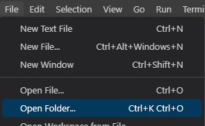
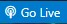

# Kana Typer

> Build Version: N/a | Dev Version: 0.1.0 \
> Supportive program in learning japanese writing system.

## Table of Contents

- [Overview](#overview)
- [Technologies Used](#technologies-used)
- [Installation](#installation)
- [Usage](#usage)
- [Configuration](#configuration)
- [Contributing](#contributing)
- [License](#license)
- [Authors](#authors)
- [Changelog](#changelog)
- [Roadmap](#roadmap)

## Overview
This web application works very similair to ones like [typefast.io](https://typefast.io/), but in this case it's specifically for Japanse characters. \
Random kana characters are generated and the user is supposed to type them correctly as fast as possible. At the end statistics are generated, like number of characters per minute.


## Technologies Used
- TypeScript 5.2.2
- Sass 1.66.1

## Installation

1. **Clone the repository**.

    ```bash
    git clone https://github.com/s25429/project-name-here.git
    ```

2. **Navigate to the project directory**.

    ```bash
    cd project-name-here
    ```

3. **Install required dev dependencies**.

    ```bash
    npm install --save-dev typescript
    npm install --save-dev sass
    ```

4. For further guidance **go to [Usage](#usage) section**.

## Usage

There are few ways to launch and use project's current dev build. You may use one depending on your needs and preferences.

### Using VSCode and Live Server (preferred)

1. **Open the project in VSCode**: You can do it in a few ways.
    1. Open folder option in VSCode \
        

    2. Use context menu by right-clicking on project folder \
        

    3. Command in terminal while being in project's directory
        ```bash
        code .
        ```
    
2. **Generate JS files using TypeScript Compiler**: 
    1. If you have installed "typescript" module simply run
        ```bash
        npm run tsc
        ```
    2. Additional configuration for TypeScript is located in `tsconfig.json`.

3. **Generate CSS files using VSCode Extension**: 
    1. Download "Live Sass Compiler" extension by Glenn Marks. \
        
    2. Launch Sass by clicking  button on the bottom right of VSCode.
    3. Additional configuration for this extension is located in `.vscode/settings.json`.
    <br></br>

4. **Install the Live Server Extension**: 
    1. Download "Live Server" extension by Ritwick Dey. \
        
    2. Launch Live Server by clicking  button on the bottom right of VSCode.
    3. You may put additional configuration for this extension either in global VSCode settings or in `.vscode/settings.json`.
    <br></br>

5. **Launch the project**: A page should open in your default browser. Select "public" folder.
    

6. **Interact with the project**: \
    As you make changes to the project's code, new JS and CSS files will be generated and page will refresh if you have section 2, 3 and 4 running in the background.

### Using a Typescript Bundler

1. No instructions yet.

### Using custom server

1. No instructions yet.

## Configuration

1. **Sass**
    * location: `./.vscode/settings.json`
    * description: specifies location for output files
2. **TypeScript**
    * location: `./tsconfig.json`
    * description: all TS-specific configuration generated by `tsc --init`

## Contributing

For now contributions will not be accepted due to project's early development.

## License 

This project is licensed under the [MIT License](https://mit-license.org/).

## Authors

- Cezary Ciślak ([@cezarycislak](cezary.cislak@gmail.com))

## Changelog

### Version 0.1.0 (2023-08-31)
- Working Prototype

## Roadmap

1. **Working prototype** ✔
    - display hiragana characters ✔
    - transform romaji to hiragana ✔
    - allow for dynamic romaji-to-hiragana transformation while typing ✔
    - generating random hiragana text to check against ✔
    - finalize results of typing by a stat chart ✔
    <br></br>

2. **MVP**
    - display hiragana similair to how [typefast.io](https://typefast.io/) looks
        - characters move from right to left
        - leave old version as additional accesibility setting
    - user-end configuration of what hiragana characters are used
        - allow user to choose only specific groups and/or characters
        - display all available characters for clarity
    - modifiable time for typing and other configuration
    - accesibility settings
        - light/dark mode
        - font size changes
        - animation preferences
        - colour scheme
        - etc.
    - smart hiragana text generation
        - less duplicate characters
        - sentence-like structure
    <br></br>

3. **Additional features**
    - rewrite app using React - will help with development of other features
    - support for katakana
        - with same configuration as hiragana
    - support for kanji
        - with same configuration as hiragana
        - furigana support (hiragana above kanji)
    - textarea to transform latin to kana with copy-paste actions
    - japanese words 
        - use those words in text generation
        - store them as ease-to-access knowledge for learners
    - extended user-end configuration for kaana character filtering
        - add or remove in an interactive tree
        - filter for any other grammar
            - youons
            - double consonants
            - etc.
    <br></br>
